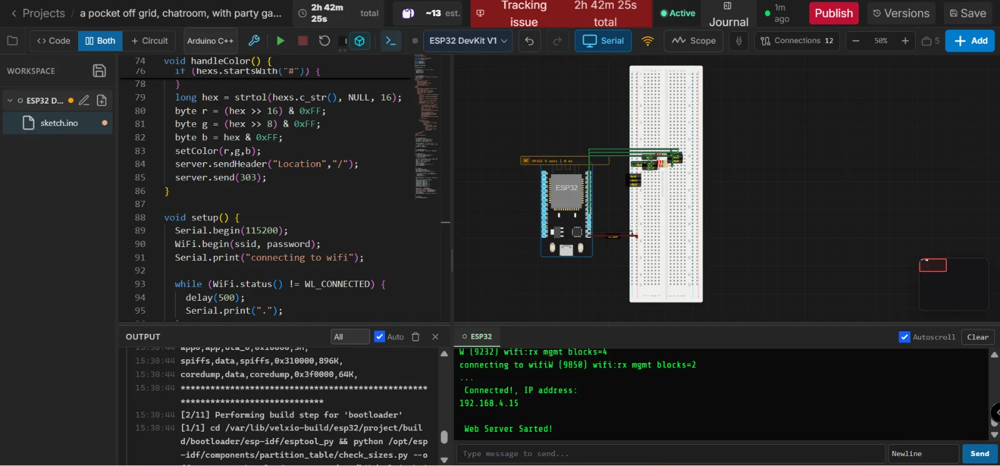

# a pocket off grid, chatroom.

> Built in [Breadboard](https://breadboard.hackclub.com), a Hack Club program. This project took ~6 hours of work.

## What It Does

a verry simple chatroom

## How It Works

The circuit is captured in `breadboard-project.json`, and the firmware that runs it is in the `firmware/` folder.

## How To Use It

click run then wait for the led to turn off, then click a button to roll a die,  the result will show up on the screen, and the led will turn green normally, but yellow if you get a crit (the max roll for that die), only press a button while led is off.

## Demo

- **Simulate it live:** [https://breadboard.hackclub.com/share/169](https://breadboard.hackclub.com/share/169), runs the firmware in the Breadboard simulator
- **View the design:** [https://taniwankenobi.github.io/breadboard-plays/p/169/](https://taniwankenobi.github.io/breadboard-plays/p/169/)

## Schematic

The editor snapshot is in `breadboard-project.json`.

## Bill of Materials

| Part | Quantity |
| --- | --- |
| esp32 | 1 |

## Firmware

Firmware files are in the `firmware/` folder.

## Build Journal

Build journal entries are kept in [`journals.md`](journals.md).

---

*Made in [Breadboard](https://breadboard.hackclub.com) — 6h of work*

